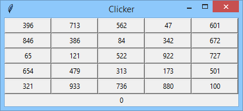
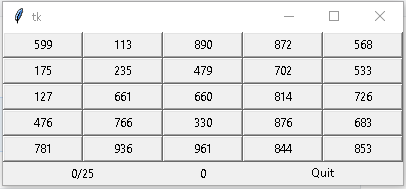
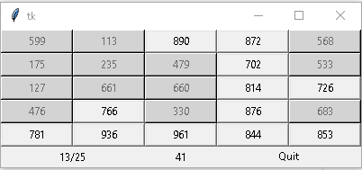
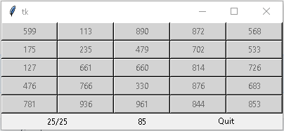

# The clicker
This is a simple perseption and memory game I made as part of my PCPP coruse (PCPP1 3/5 GUI 3.1.1.4 on edube.org) focussing on GUI using the tkinter libary.

## Brief:
(From edube.org- https://edube.org/learn/pcpp1-4-gui-programming/lab-the-clicker)
### Objectives
Learn practical skills related to:

- writing event handlers and assigning them to widgets using the bind() method,
- managing widgets with the grid manager,
- using the after() and after_cancel() methods.

### Scenario
We want you to write a simple but challenging game, which can help many people to improve their perception skills and visual memory. We'll call the game The Clicker as clicking is what we expect from the player.  

The Clicker's board consists of 25 buttons and each of the buttons contains a random number from range 1..999. Note: each number is different!  

Below the board there is a timer which initially shows 0. The timer starts when the user clicks the board for the first time.  

Here's how we imagine The Clicker's initial board state:  

  

We expect the player to click all the buttons in the order imposed by the numbers - from the lowest to the highest one. Additional rules say that:

- the properly clicked button changes the button's state to DISABLED (it greys the button out)
- the improperly clicked button shows no activity,
- the timer increases its value every second,
- when all the buttons are greyed out (i.e., the player has completed his/her task) the timer stops immediately.

This is how the board looks when the game is finished:  

  

Hint: consider using the `<Button-1>` event instead of setting the command button property - it may simplify your code.  

## My results: 
I added a counter to keep track of your progress and a quit button to even out the other side.  
Initial view:  
  
Part way:  
  
Finished:  
  
