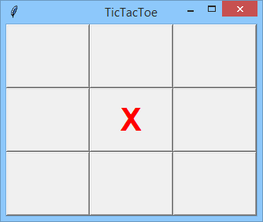
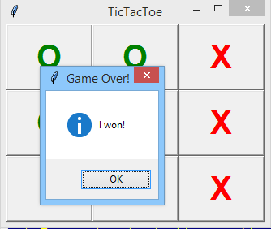
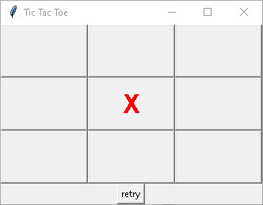
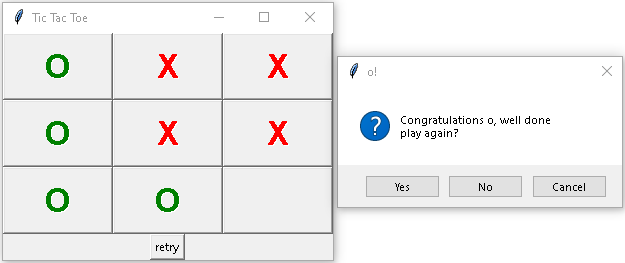
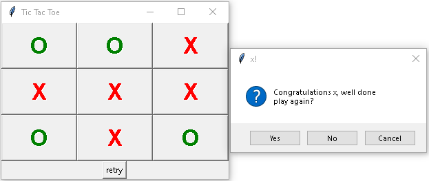
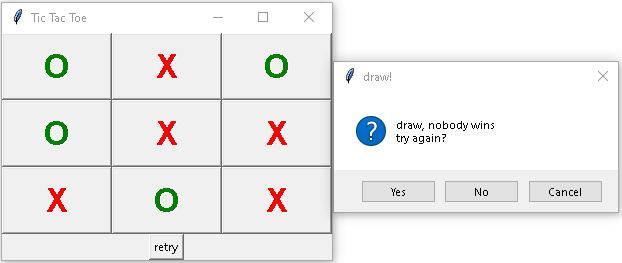

# Tic-Tac-Toe
This is a simple game of tic-tac-toe I made as part of my PCPP coruse (PCPP1 3/5 GUI 3.1.1.6 on edube.org) focussing on GUI using the tkinter libary.

## Brief:
(From edube.org- https://edube.org/learn/pcpp1-4-gui-programming/lab-tic-tac-toe)

### Objectives
Learn practical skills related to:

- dealing with the grid geometry manager,
- defining and using callbacks,
- identifying and servicing GUI events.

### Scenario
Write a simple GUI program which pretends to play tic-tac-toe with the user. Don't be afraid, we don't want you to implement artificial intelligence algorithms. You can do it, if you want, but we prefer to concentrate on the user interface issues. If you really want to create an actual competitor, do it on your own.

This is what the game you are about to write looks like (the beginning and sample end of the game):

To make your task a bit easier, let's simplify the game a bit. Here are our assumptions:.

- the computer (i.e., your program) plays 'X', and Xes are always red,
- the user (e.g., you) plays 'O', and Os are always green,
- the board consists of 9 tiles, and the tile role is played by a button,
- the first move belongs to the computer - it always puts its first 'X' in the middle of the board,
- the user enters her/his move by clicking the chosen tile (clicking the tiles which are not free is ineffective)
- the program checks if the game over conditions are met, and if the game is over, a message box is displayed announcing the winner,
- otherwise the computer responds with its move and the check is repeated,
- use random to generate the computer's moves.

## My results:
I added a retry button as well as an option to play again or quit on the end message.  
Sart:  
  
Player wins:  
  
Computer wins:  
  
Draw:  
  
