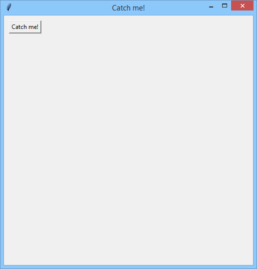

# Catch me if you can!
This is a simple mouse game I made as part of my PCPP coruse (PCPP1 3/5 GUI 3.1.1.3 on edube.org) focussing on GUI using the tkinter libary.  

## Brief:
(From edube.org- https://edube.org/learn/pcpp1-4-gui-programming/lab-catch-me-if-you-can)
### Objectives
Learn practical skills related to:

- using screen coordinates,
- managing widgets with the place manager,
- binding events using the bind() method.
### Scenario
Write a simple game - an infinite game which humans cannot win. Here are the rules:  

- the game goes on between TkInter and the user (probably you)
- TkInter opens a 500x500 pixel window and places a button saying "Catch me!" in the top-left corner of the window;
- if the user moves the mouse cursor over the button, the button immediately jumps to another location inside the window; you have to assure that the new location is distant enough to prevent the user from making an instant click,
- the button must not cross the window's boundaries during the jump!   

Here is a sample picture for your reference:  

  

Use the place() method to move the button, and the bind() method to assign your own callback.

## My results:
Initial view:  
  
Gif of opperation:  

