# Pocket calculator
This is a imatation of a pocket calculator I made as part of my PCPP coruse (PCPP1 3/5 GUI 3.2.1.1 on edube.org) focussing on GUI using the tkinter libary.

## Brief:
(From edube.org- https://edube.org/learn/pcpp1-4-gui-programming/project-pocket-calculator)
### Objectives
Learn practical skills related to:

- dealing with observable variables,
- working with the Entry widget,
- constructing complex interfaces with many cooperating Button widgets.

### Scenario
Have you ever used an ordinary pocket calculator? We prefer to ask you first as we're aware of the fact that these devices went out of fashion some time ago and they were replaced with computer and smartphone's applications.

This is exactly what we want you to implement - a simple, four-function "pocket" calculator. Feel free to equip it with many extra functions, but adding, subtracting, multiplying and dividing is a must - there is no calculator without these operations.

Moreover, the calculator needs a change sign function, a decimal point button and the clear button. We don't have to mention that your calculator should be resistant to zero-division attempts, in which case it should display an error message instead of producing any garbage result or raising an exception.

The screenshots we present below are just a suggestion. You can design the UI in a different way, and it will be good as long as your calculator works properly. We aren't able to collect all strict requirements in one place - we can only say that each time you have doubts about how to implement a particular behavior, you should just pick up a real pocket calculator and check how it works in the specific context.

See how we've implemented our GUI (initial state, presenting a result, and handling zero-division attempt) - do you like it?

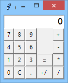  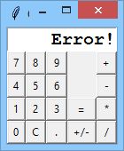

Here are some of our assumptions:

- respond only to mouse clicks; keyboard presses can be silently ignored,
- the display's width is 10 - use a fixed-width font to work with it,
- you are not allowed to fill the display with more than 10 characters (including the decimal point and minus sign if it is needed); if the result needs more characters to be presented, you should display an error message,
- you are allowed to remove some less significant digits located after the decimal point to shorten the result in effect,
- if the result has no significant digits after the decimal point, the point should not appear on the display.

## My results:  

Initial:  
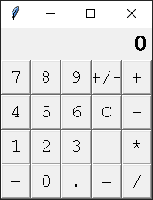  
Full display (10 charecters, inc. decimal and negative):  
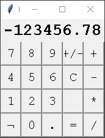  
Full display 2 (all numbers):  
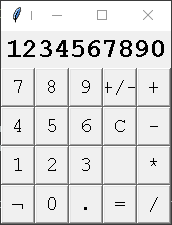  
Chain addition (1+2+3=6):  
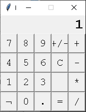
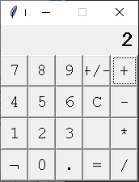
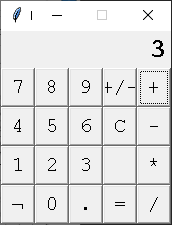
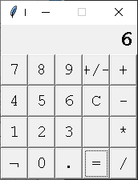  
Chain subtraction (10-9-8=-7):  
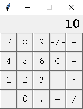
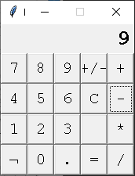

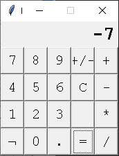  
BackSpace:  

  
Zero division error:  
  
Length error:  

  
Mulitiplcation:  

  
Division whole number:  

  
Division decimal number:  

  