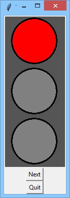
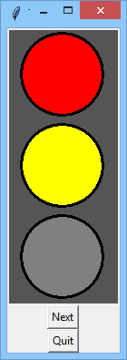
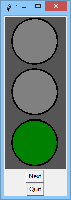
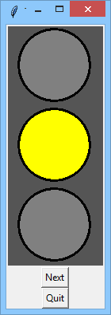
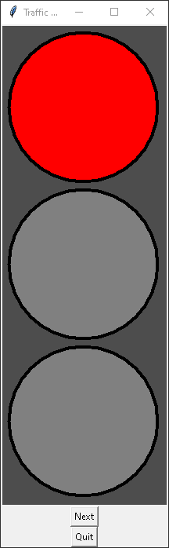
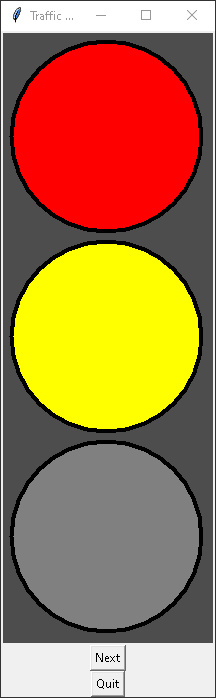
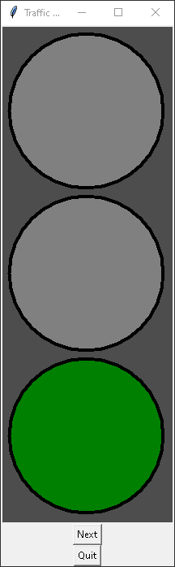
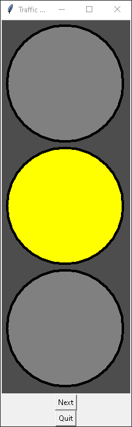
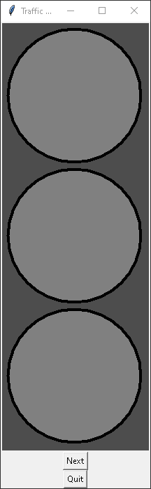
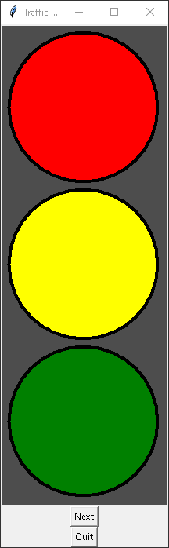

# Traffic lights
This is a simple traffic lights demostration I made as part of my PCPP coruse (PCPP1 3/5 GUI 3.1.1.5 on edube.org) focussing on GUI using the tkinter libary.

## Brief:
(From edube.org- https://edube.org/learn/pcpp1-4-gui-programming/lab-traffic-lights)
### Objectives
Learn practical skills related to:

- dealing with Canvas and some of its methods,
- using different colors.

### Scenario
Look at the snippet in the editor - can you see that mysterious tuple consisting of four three-element tuples? Can you guess what information it carries?

It's a set of rules describing the behavior of British-style traffic lights. Assume that the very first element of all inner tuples is assigned to the red light, the second - to the yellow, and the third - to the green one. True means that the light is on, False - off.

As you see, there are four different phases:

- the red light is lit,
- the red and yellow lights are lit together,
- the green light is lit,
- the yellow light is lit.
Your task is to implement a model which will show how such a traffic signal works. The model should look as follows:

As you see, the model is built of three widgets:

- the canvas being a background for all the three lights,
- the button named "Next" - clicking it switches the signal to the next phase,
- the button named "Quit" - clicking it immediately exits the program.
Note: use the phases tuple as a "knowledge base" for your whole code. The code has to adopt to any change done to the tuple, e.g., there can be more or less than four phases and the lights' combinations can be different also.

If traffic lights in your home country work in a different way, you can implement your native scheme, but the only change you're allowed to make is to modify the phases tuple - the code itself must remain the same.

## My results:
I added more phases and the ablity to add more lights (controled by the first arugement of make_lights(3, [list of colours]) on line 50), although on my screen I can't fit more than 4 but you can change the size of the lights on line 38.  
Red:  
  
Red and yellow:  
  
Green:  
  
Yellow:  
  
None (I added this one myself):  
  
All (I added this one aswell):  

